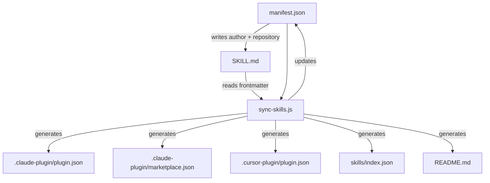

A living document for understanding how this repository is structured and how its parts fit together.

## Project Structure

The repository follows a clear organizational pattern with manifest-driven configuration:

```
./
├── manifest.json                       # Source of truth — global config, keywords, skills array
├── skills/
│   ├── index.json                      # Generated — agent-skills-discovery RFC index
│   └── <skill-name>/
│       ├── SKILL.md                    # Entry point — frontmatter + instructions + reference index
│       ├── references/                 # Detailed reference docs (API guides, guidelines, etc.)
│       ├── scripts/                    # Helper scripts for the skill
│       └── assets/                     # Static assets (CSS, images, etc.)
├── scripts/
│   ├── sync-skills.js                  # Syncs manifest.json → plugin files, marketplace, index.json, README
│   └── add-skill.js                    # Scaffolds a new skill directory with SKILL.md
├── .claude-plugin/
│   ├── plugin.json                     # Generated — Claude Code plugin manifest
│   ├── plugin.schema.json              # JSON Schema for Claude Code plugin.json validation
│   └── marketplace.json                # Claude Code marketplace (single plugin entry)
├── .cursor-plugin/
│   ├── plugin.json                     # Generated — Cursor plugin manifest
│   └── plugin.schema.json              # JSON Schema for Cursor plugin.json validation
├── .github/
│   ├── workflows/validate-and-sync.yml # CI — validate skills, validate plugins, sync on main
│   └── CONTRIBUTING.md                 # Contribution guidelines
├── assets/                             # Shared static assets (logo, etc.)
├── CLAUDE.md                           # Project instructions for Claude Code
├── AGENTS.md                           # Project instructions for other AI coding agents
├── README.md                           # Public-facing documentation
└── LICENSE                             # MIT
```

## Data Flow

The repository uses a sophisticated sync system where `manifest.json` serves as the central source of truth:



<Note>
The sync script preserves global fields in manifest.json while updating the skills array from discovered SKILL.md files.
</Note>

### What Lives Where

Understanding the source of truth for each piece of data is crucial:

| Data | Source of truth | Flows to |
|------|----------------|----------|
| Plugin name, description, author, homepage, repo, license | `manifest.json` (global fields) | Both plugin.json files, marketplace.json |
| Plugin keywords | `manifest.json` → `keywords` | Both plugin.json files, marketplace.json |
| Logo | `manifest.json` → `logo` | `.cursor-plugin/plugin.json` only |
| Author, repository | `manifest.json` (global fields) | `SKILL.md` → `metadata.author`, `metadata.repository` |
| Skill name, description, version, license | `SKILL.md` frontmatter | `manifest.json` → `skills[]`, `skills/index.json` |
| Skill keywords | `SKILL.md` → `metadata.keywords` | `manifest.json` → `skills[].keywords` |
| Skill file listing | Filesystem (skill directory contents) | `skills/index.json` → `skills[].files` |
| Plugin version | `manifest.json` → `version` | Both plugin.json files, marketplace.json |
| Skill version | `SKILL.md` → `metadata.version` | `manifest.json` → `skills[].version` |

## CI/CD Pipeline

The repository uses GitHub Actions for automated validation and synchronization.

**Workflow:** `.github/workflows/validate-and-sync.yml`

**Triggers:** Changes to `**/SKILL.md`, `manifest.json`, `.claude-plugin/**`, `.cursor-plugin/**` on `main` or PRs to `main`.

<Steps>
  <Step title="Detect changes">
    The workflow first identifies which files have changed to determine what validation is needed.
  </Step>
  
  <Step title="Validate skills">
    Uses a matrix strategy to validate each changed skill using `Flash-Brew-Digital/validate-skill@v1`.
  </Step>
  
  <Step title="Validate plugins">
    Runs AJV validation against JSON schemas, but only if plugin files changed.
  </Step>
  
  <Step title="Sync">
    Runs on main branch only, after both validation jobs pass or are skipped:
    - Executes `node scripts/sync-skills.js`
    - Auto-commits generated files
  </Step>
</Steps>

<Info>
The sync job uses `always() && !failure() && !cancelled()` so that skipped validation jobs (e.g., no plugin files changed) don't block it.
</Info>

## Scripts Overview

Two key scripts power the repository's automation:

### sync-skills.js

**Purpose:** Discover skills from `skills/*/SKILL.md`, update manifest and generated files

**Reads:**
- `SKILL.md` frontmatter from all skill directories
- `manifest.json` global configuration

**Writes:**
- `manifest.json` (updates skills array)
- `.claude-plugin/plugin.json`
- `.claude-plugin/marketplace.json`
- `.cursor-plugin/plugin.json`
- `skills/index.json`
- `README.md` (updates skills table)

**Key Functions:**
- `discoverSkills()` - Scans skills directory and parses SKILL.md frontmatter
- `updateManifest()` - Syncs skill metadata to manifest.json
- `updatePlugin()` - Generates platform-specific plugin.json files
- `updateMarketplace()` - Updates Claude marketplace listing
- `updateIndex()` - Creates agent-skills-discovery RFC index
- `updateReadme()` - Regenerates skills table in README
- `updateSkillFrontmatter()` - Propagates author/repository to SKILL.md files

### add-skill.js

**Purpose:** Scaffold a new skill directory with proper structure

**Reads:**
- `manifest.json` for author and license defaults

**Writes:**
- `skills/<name>/SKILL.md` with template frontmatter
- Then calls `sync-skills.js` to register the new skill

**Key Functions:**
- `normalizeName()` - Converts input to lowercase-with-hyphens format
- `generateSkillMd()` - Creates SKILL.md template with frontmatter
- `runSyncScript()` - Spawns sync-skills.js to complete registration

## Platform Differences

Claude Code and Cursor have different feature support:

| Field | Claude Code | Cursor |
|-------|-------------|--------|
| `logo` | ❌ Not supported | ✅ Supported |
| `rules` | ❌ Not supported | ✅ Supported |
| `lspServers` | ✅ Supported | ❌ Not documented |
| `outputStyles` | ✅ Supported | ❌ Not documented |

<Info>
Both platforms support: `name`, `description`, `version`, `author`, `homepage`, `repository`, `license`, `keywords`, `skills`, `commands`, `agents`, `hooks`, `mcpServers`.
</Info>

## Project Identification

- **Project:** Webflow Agent Skills
- **Repository:** https://github.com/224-industries/webflow-skills
- **Maintainer:** [Ben Sabic](https://bensabic.dev) at [224 Industries](https://224industries.com.au)
- **License:** MIT
- **Last Updated:** 2026-02-23
